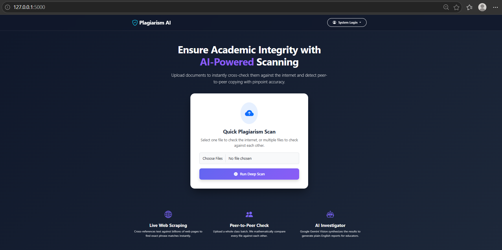
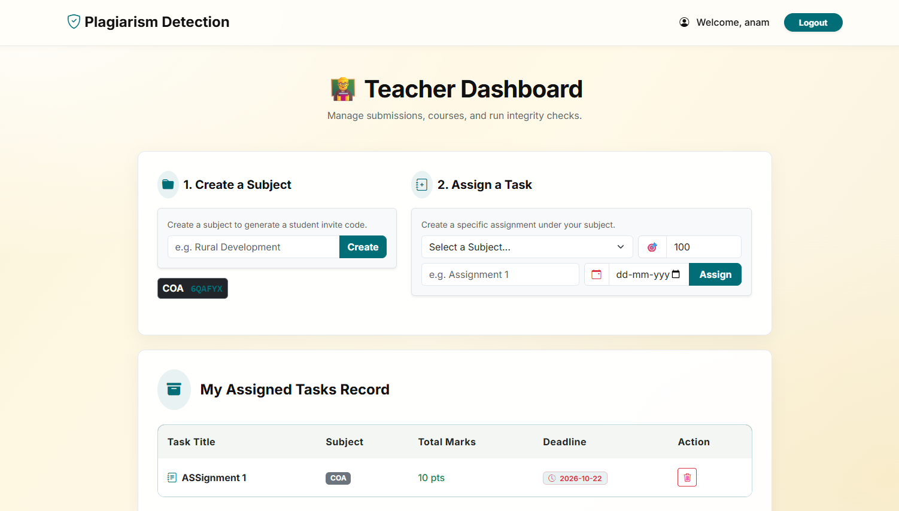
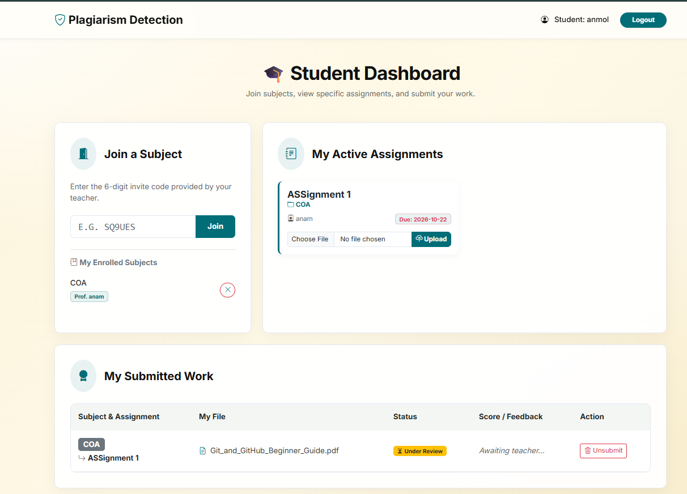
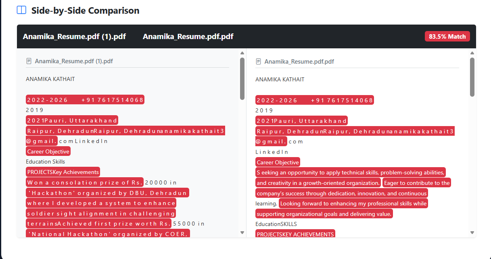
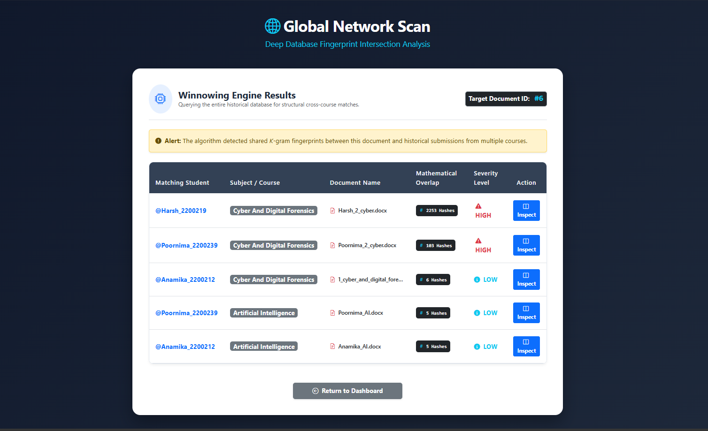
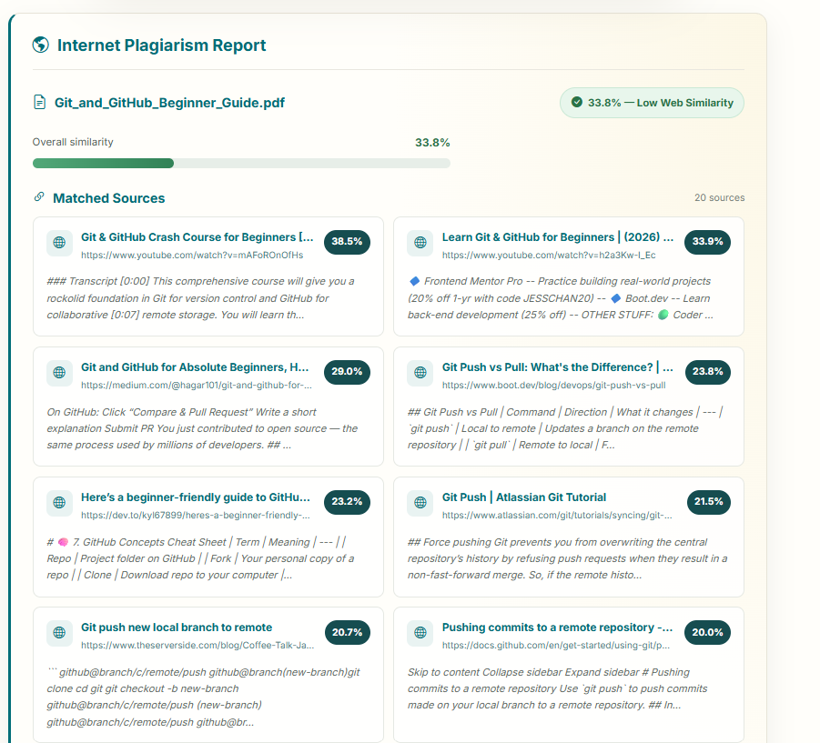

# PlagiarismGuard
---
title: PlagiarismGuard
emoji: 📄
colorFrom: blue
colorTo: indigo
sdk: docker
app_port: 7860
---
A web app where teachers create courses and assignments, students submit documents, and the system checks submissions for plagiarism: against each other, against previously submitted work, and against the internet.

Built with Python, Flask, SQLite and NLP.

## Features

**Teacher portal**
- Create courses with auto-generated invite codes
- Create tasks with deadlines and total marks
- View submissions, grade them, and leave feedback

**Student portal**
- Join a course with an invite code
- Upload PDF / DOCX / TXT submissions for a task
- See marks and feedback

**Plagiarism detection**
- **Peer comparison:** semantic similarity (sentence embeddings) plus sentence-level highlighting between documents
- **Global scan (Winnowing):** each submission is fingerprinted with the Winnowing algorithm and stored, so new work is checked against all earlier submissions
- **Internet scan:** searches the web with the Tavily API, fetches matching pages, and scores each source with several similarity signals (sequence match, keyword overlap, n-gram fingerprinting, sentence-level matching)
- **AI report:** Gemini writes a short investigator summary naming the matched URLs

## Screenshots

| Home | Teacher dashboard | Student dashboard |
|---|---|---|
|  |  |  |

| Side-by-side comparison | Global scan | Internet scan |
|---|---|---|
|  |  |  |

Algorithm benchmarks are in [`docs/benchmarks/`](docs/benchmarks).

## Project structure

```
plagiarism-checker/
├── run.py                  # start the server
├── requirements.txt
├── .env.example            # copy to .env and add your keys
├── app/
│   ├── __init__.py         # create_app() factory
│   ├── config.py           # settings, read from environment
│   ├── extensions.py       # Flask-Login
│   ├── db.py               # SQLite connection, schema, migrations
│   ├── models.py           # User model
│   ├── routes/
│   │   ├── auth.py         # register, login, logout
│   │   ├── student.py      # join course, upload, delete
│   │   ├── teacher.py      # courses, tasks, grading
│   │   └── analysis.py     # compare, global scan, inspect
│   ├── services/
│   │   ├── text_extraction.py   # PDF/DOCX/TXT -> text, highlighting
│   │   ├── winnowing.py         # k-gram fingerprinting
│   │   ├── semantic.py          # sentence-embedding similarity
│   │   ├── internet_scan.py     # Tavily web scan + scoring
│   │   └── ai_report.py         # Gemini investigator report
│   ├── templates/
│   └── static/
├── scripts/                # benchmark scripts that generate the graphs
├── docs/                   # screenshots and benchmark graphs
└── instance/               # database + uploads (git-ignored)
```

## Getting started

```bash
git clone https://github.com/<your-username>/plagiarism-checker.git
cd plagiarism-checker

python -m venv venv
venv\Scripts\activate          # macOS/Linux: source venv/bin/activate
pip install -r requirements.txt

copy .env.example .env         # macOS/Linux: cp .env.example .env
# open .env and fill in your keys

python run.py
```

Open http://127.0.0.1:5000.

### Environment variables

| Variable | Purpose |
|---|---|
| `SECRET_KEY` | Signs login sessions. Use a long random string. |
| `GEMINI_API_KEY` | Google Gemini key for AI reports |
| `GEMINI_MODEL` | Gemini model name (default `gemini-1.5-flash`) |
| `TAVILY_API_KEY` | Tavily key for the internet scan |

The app starts without the API keys. Peer comparison and the global scan still work, and only the internet scan and AI report are disabled.

The first peer comparison downloads the `all-MiniLM-L6-v2` model (about 90 MB), so it takes longer once.

### Regenerate benchmark graphs

```bash
python scripts/benchmark.py
python scripts/algorithm_comparison.py
```

## Notes

- Uploaded documents and the database are stored in `instance/` and are never committed.
- Accepted upload types: PDF, DOCX, TXT.

## License

MIT
